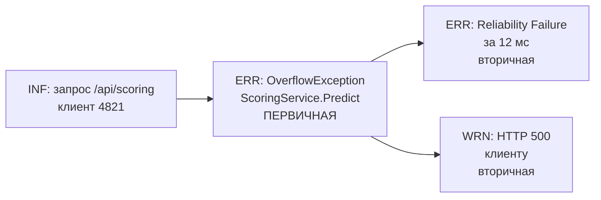

# Практическая работа №10

**СПбИЭУ · МДК 03.02 «Обеспечение качества и функционирования компьютерных систем»**
**Тема 2.2 №10. Анализ отчёта о сбое и классификация дефектов**

| | |
|---|---|
| Выполнил | Иванов Егор Михайлович, группа И14-23-9 |
| Специальность | 09.02.07 «Информационные системы и программирование» |
| Проверила | Чудинова Александра Анатольевна |
| Вариант | 1 |
| Год | 2026 |

---

## 1. Цель работы

Научиться сопоставлять фактическое поведение информационной системы с требованиями технического задания, разделять зафиксированные в логе проблемы на первичные (корневые) и вторичные (производные) и оценивать критичность сбоя по критериям надёжности.

## 2. Исходные данные и описание проекта

Работа выполняется на проекте **AiApi — сервис кредитного скоринга**. Его же я продолжаю в работах №11–13.

**Что это за система.** Это .NET 8 Web API, через который фронтенд заявки на займ отправляет параметры клиента. Сервис передаёт их во встроенную ML-модель (ONNX) и возвращает решение «одобрить / отказать». Основные пользователи — кредитные специалисты микрофинансовой организации и веб-форма заявки, через которую клиент подаёт данные сам.

**Фрагмент ТЗ (вариант 1):**

> Система кредитного скоринга должна принимать числовые параметры клиента (income, age, credit_history), передавать их во встроенный ML-сервис и возвращать JSON-ответ с решением об одобрении займа за время, не превышающее 100 мс.

**Лог-отчёт:**

```text
[10:14:02 INF] Получен запрос /api/scoring для клиента ID 4821.
[10:14:02 ERR] System.OverflowException: Arithmetic operation resulted in an overflow. at ScoringService.Predict(Single[] input)
[10:14:02 ERR] [Reliability Failure] Критическая ошибка при выполнении инференса за 12 мс.
[10:14:02 WRN] Клиент получил HTTP 500 Internal Server Error.
```

## 3. Ход выполнения работы

### 3.1. Сравнение с ТЗ

Чтобы точно понять, в каком месте поведение разошлось с требованиями, я разбил формулировку ТЗ на отдельные проверяемые требования и сопоставил каждое с записями лога.

| № | Требование из ТЗ | Что видно в логе | Статус |
|---|---|---|---|
| Т1 | Принимать числовые параметры клиента (income, age, credit_history) | `INF` — запрос на `/api/scoring` для клиента 4821 получен | Выполнено |
| Т2 | Передавать параметры во встроенный ML-сервис | Вызов `ScoringService.Predict(Single[] input)` состоялся, но завершился исключением | Выполнено частично |
| **Т3** | **Возвращать JSON-ответ с решением об одобрении займа** | **Клиент получил `HTTP 500 Internal Server Error`, решения нет** | **Нарушено** |
| Т4 | Время ответа ≤ 100 мс | Инференс упал через 12 мс | Формально выполнено |

**Вывод по пункту.** Расхождение зафиксировано в требовании Т3: ТЗ обязывает систему вернуть JSON с решением по займу, а клиент получил ошибку сервера без какого-либо решения.

Требование Т4 формально соблюдено (12 мс < 100 мс), но толку от этого нет. Быстрый ответ, в котором нет результата, требованию по смыслу не соответствует. Проверка «уложились ли во время» имеет смысл только для корректного ответа.

Ещё одно наблюдение относится к самому ТЗ. В нём сказано, что параметры «числовые», но не заданы допустимые диапазоны (например, максимальный доход или возраст от 18 до 100). Из-за этого разработчик не обязан был проверять границы значений. Пробел в требованиях, по моей оценке, и создал условия для дефекта (подробнее в п. 3.2).

### 3.2. Разделение ошибок на первичные и вторичные

Все четыре записи имеют одно время `10:14:02` и относятся к одному запросу клиента 4821. Сначала запрос пришёл, затем упал метод модели, после этого сработал мониторинг и клиент получил ответ. Цепочка последовательная, поэтому её можно разбирать как один инцидент.



| Запись лога | Тип | Обоснование |
|---|---|---|
| `INF` Получен запрос /api/scoring | Не ошибка | Информационная запись, задаёт контекст инцидента |
| `ERR System.OverflowException ... at ScoringService.Predict(Single[] input)` | **Первичная** | Здесь сбой зародился. Есть тип исключения и конкретный метод в стеке, раньше в цепочке ошибок нет |
| `ERR [Reliability Failure] Критическая ошибка ... за 12 мс` | Вторичная | Запись системы мониторинга о последствии. Она фиксирует, что инференс упал, но причину не добавляет |
| `WRN Клиент получил HTTP 500` | Вторичная (симптом) | Исключение не было обработано, и ASP.NET Core вернул стандартный ответ 500. Это то, что увидел пользователь |

**Что могло вызвать OverflowException.** Входной массив имеет тип `Single[]` (float). Обычная арифметика с float в .NET не бросает `OverflowException`: при переполнении получается `Infinity`. Значит, исключение возникло при **преобразовании** значения в целочисленный тип внутри `Predict`. Это может быть `Convert.ToInt32(...)`, приведение в `checked`-контексте или перевод суммы дохода в копейки как `int`.

> **Допущение.** Исходного кода `ScoringService.Predict` в задании нет. Поэтому конкретное место переполнения я указываю как наиболее вероятное по типу исключения и сигнатуре метода. Вероятнее всего, клиент 4821 указал большой доход (например, 25 000 000 руб.). При переводе в копейки получается 2,5 млрд, а это больше `int.MaxValue` = 2 147 483 647.

Корневая проблема — **отсутствие проверки диапазона входных параметров** перед их преобразованием и подачей в модель. Исправлять нужно именно её. Если просто «спрятать» HTTP 500, сломанным останется сам расчёт.

### 3.3. Оценка рисков

Критичность я оценивал по критериям надёжности из лекции (вероятность × последствия) и по характеристике «Надёжность» стандарта ISO/IEC 25010.

| Критерий | Оценка | Комментарий |
|---|---|---|
| Затронутая функция | Основная | Скоринг — главная функция сервиса, без неё он бесполезен |
| Результат для пользователя | Полный отказ | Решения нет, заявка зависла |
| Последствия | Высокие (5 из 5) | Потеря клиента и выручки, ручная перепроверка заявки специалистом |
| Вероятность повторения | Средняя (3 из 5) | Сбой повторится у **каждого** клиента со значением вне допустимого диапазона, это не случайная ошибка |
| Обнаружимость | Хорошая | Ошибка видна в логе и по коду 500, она не замаскирована |
| Подхарактеристики ISO/IEC 25010 | Отказоустойчивость, завершённость | Система не перехватывает некорректный ввод и не переходит в безопасное состояние |

Условная оценка риска по шкале 5×5: **3 × 5 = 15 из 25**. По матрице рисков это высокий уровень.

> Шкала 1–5 условная, я ввёл её для наглядности. Методичка конкретной шкалы не задаёт.

**Вывод:** сбой относится к **критическим**. Отказывает основная функция системы, клиент не получает результата, а дефект воспроизводится на определённом классе входных данных, то есть будет повторяться.

### 3.4. Предлагаемые меры

1. **Валидация на входе.** Добавить в контроллер проверку диапазонов (`[Range]` или FluentValidation) и при выходе за границы возвращать `400 Bad Request` с понятным текстом. В ТЗ дописать допустимые диапазоны параметров.
2. **Безопасная арифметика.** Убрать преобразование дохода в `int` и работать в `float`/`double` с нормализацией признаков перед подачей в модель.
3. **Защитный декоратор** вокруг модели (`MonitoredEmbeddedModelService`): перехват исключений и возврат безопасного fallback-результата. Реализуется и проверяется тестом в работе №12.
4. **Глобальный обработчик ошибок (middleware)**: вместо «голого» 500 возвращать клиенту JSON с TraceId. Реализуется в работе №13.

## 4. Ответы на вопросы

**1. В чём главное различие между верификацией и валидацией программного продукта?**

Верификация отвечает на вопрос «правильно ли мы делаем продукт», то есть соответствует ли он спецификации и ТЗ. Валидация отвечает на вопрос «тот ли продукт мы делаем», то есть решает ли он реальную задачу пользователя. На моём примере: проверка, что ответ пришёл за ≤100 мс и в формате JSON, — это верификация. Проверка, что кредитный специалист действительно получил пригодное для работы решение по клиенту, — это валидация. Система может пройти первую проверку и провалить вторую.

**2. Почему поиск и устранение исключительно вторичных ошибок не решает проблему надёжности системы?**

Вторичная ошибка — это следствие. Если, например, перехватить HTTP 500 и отдавать вместо него 200 с пустым телом, лог станет «чище», но `OverflowException` в `Predict` никуда не денется. Каждый следующий клиент с большим доходом снова останется без решения, только теперь это будет ещё и незаметно. Надёжность растёт, только когда устранена первопричина, в моём случае отсутствие проверки диапазона входных данных.

**3. Каким образом техническое задание помогает объективно оценить качество готового программного решения?**

ТЗ — эталон, с которым сравнивается фактическое поведение. Благодаря ему я смог не рассуждать «вроде работает плохо», а указать конкретное нарушенное требование (Т3) и показать, что требование по времени (Т4) формально выполнено. Работа показала и обратную сторону: если в ТЗ чего-то нет (здесь — диапазонов параметров), то и объективно проверить это нельзя. Поэтому одна из моих рекомендаций — дополнить само ТЗ.

## 5. Вывод

Я разобрал лог-отчёт сбоя сервиса кредитного скоринга и сопоставил его с ТЗ. Нарушено требование о возврате JSON-ответа с решением по займу: клиент получил HTTP 500. Первичной ошибкой является `System.OverflowException` в методе `ScoringService.Predict`, вызванная, по всей видимости, отсутствием проверки диапазона входных параметров. Записи `Reliability Failure` и `HTTP 500` — вторичные последствия. Сбой отнесён к критическим: отказывает основная функция, и дефект будет повторяться на определённом классе данных. Предложенные исправления (валидация входа, защитный декоратор, глобальный обработчик ошибок) я реализую и проверяю в следующих работах.
