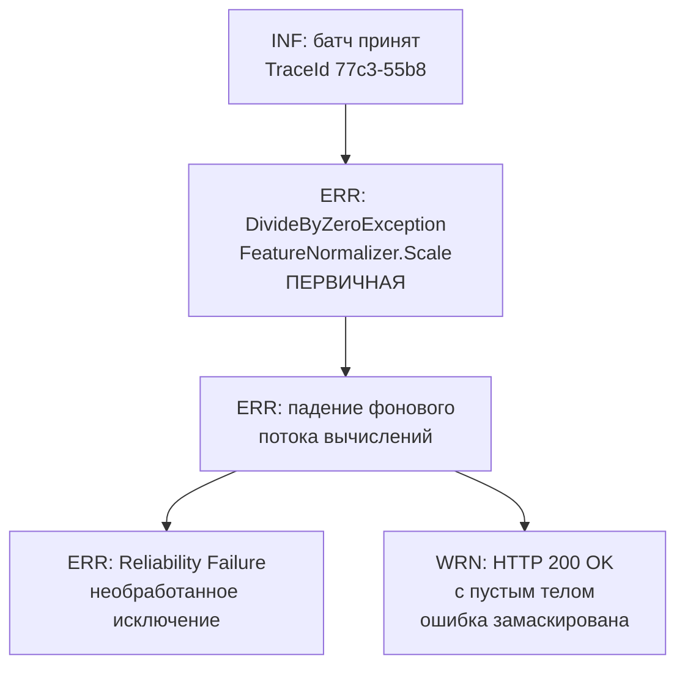

# Практическая работа №11

**СПбИЭУ · МДК 03.02 «Обеспечение качества и функционирования компьютерных систем»**
**Тема 2.2 №11. Инженерное расследование: расшифровка лог-отчёта и поиск Root Cause**

| | |
|---|---|
| Выполнил | Иванов Егор Михайлович, группа И14-23-9 |
| Специальность | 09.02.07 «Информационные системы и программирование» |
| Проверила | Чудинова Александра Анатольевна |
| Кейс | №4 «Деление на ноль в математическом модуле предобработки» |
| Год | 2026 |

---

## 1. Цель работы

Освоить чтение структурированных системных логов .NET 8 API: выделять сквозной идентификатор запроса (TraceId), отделять первичный сбой от каскадных симптомов и проектировать точечное инженерное исправление.

## 2. Исходные данные

Проект тот же, что в работе №10: **AiApi — сервис кредитного скоринга** на .NET 8 со встроенной ONNX-моделью. Перед подачей в модель сырые признаки клиента (доход, возраст, кредитная история и т. д.) проходят предобработку в модуле `FeatureNormalizer`. Он приводит значения к одному масштабу, иначе модель будет «перевешивать» признаки с большими абсолютными значениями, например доход.

**Контекст ТЗ (кейс 4):**

> Перед подачей сырых данных в модель нормализатор должен проверять знаменатель на нулевые значения.

**Лог-отчёт:**

```text
[16:12:44 INF] Входной батч принят в обработку. TraceId: 77c3-55b8
[16:12:44 ERR] System.DivideByZeroException: Attempted to divide by zero. at FeatureNormalizer.Scale(Single[] values)
[16:12:44 ERR] Аварийное завершение фонового потока вычислений.
[16:12:44 ERR] [Reliability Failure] Необработанное исключение внутри сервиса.
[16:12:44 WRN] Клиент получил пустой некорректный ответ HTTP 200 OK (ошибка замаскирована).
```

**Задание для разбора:** объяснить опасность маскирования ошибок и предложить защитную валидацию входных параметров.

## 3. Ход выполнения работы

Работу выполнял по алгоритму из методического руководства: трассировка, разделение ошибок, инженерное решение.

### 3.1. Трассировка запроса (TraceId)

Идентификатор запроса в логе — **`TraceId: 77c3-55b8`**. Он указан только в первой строке.

Что все пять строк относятся к одному запросу, я установил по трём признакам:

1. **Время.** Все записи имеют одну метку `16:12:44`, разрыва нет.
2. **Причинная связь.** Каждая следующая строка логически вытекает из предыдущей: батч принят, затем деление на ноль, падение потока, запись мониторинга и, наконец, ответ клиенту.
3. **Компонент.** Исключение произошло в `FeatureNormalizer.Scale`, то есть именно на этапе предобработки только что принятого батча.

**Замечание по качеству логирования.** TraceId стоит только у первой записи, у записей об ошибках его нет. При нагрузке, когда за одну секунду обрабатываются десятки запросов, я не смог бы доказать, что `DivideByZeroException` относится именно к запросу `77c3-55b8`. Это недостаток диагностируемости системы. Его устраняет сквозной TraceId через middleware и scope логгера, это делается в работе №13.

### 3.2. Разделение ошибок (Root Cause Analysis)



**Первичная ошибка (Root Cause)**

```text
[16:12:44 ERR] System.DivideByZeroException: Attempted to divide by zero. at FeatureNormalizer.Scale(Single[] values)
```

**Анализ.** Метод нормализации делит на знаменатель, рассчитанный по входным данным. При min-max нормализации знаменатель равен `max − min`, при z-нормализации — стандартному отклонению. Если все значения признака в батче одинаковые (например, батч из одной заявки или все клиенты указали одинаковую кредитную историю `0`), знаменатель становится равным нулю.

ТЗ прямо требует перед делением проверять знаменатель на ноль. В коде этой проверки нет, поэтому первопричина — **не реализованное требование ТЗ**, программный дефект в модуле предобработки.

**Техническая деталь, которую я заметил при разборе.** Для `float` (Single) деление на ноль в .NET **не бросает** `DivideByZeroException`, результатом будет `Infinity` или `NaN`. Исключение возникает только при целочисленном делении или делении `decimal`. Значит, внутри `Scale` знаменатель приводится к `int` или `decimal`.

> **Допущение.** Кода `FeatureNormalizer` в задании нет, вывод сделан по типу исключения и сигнатуре метода.

Из этого следует важный практический вывод. Если просто перевести расчёт на `float`, исключение исчезнет, но модель получит `NaN`, и ошибка станет **полностью скрытой**. Поэтому нужна именно явная проверка знаменателя, а не смена типа.

**Вторичные симптомы (Cascading Failures)**

| Запись | Почему это следствие |
|---|---|
| `Аварийное завершение фонового потока вычислений` | Исключение не перехвачено внутри задачи и завершило поток, в котором шёл расчёт |
| `[Reliability Failure] Необработанное исключение` | Мониторинг зафиксировал факт необработанного исключения. Новой информации о причине здесь нет |
| `HTTP 200 OK с пустым телом` | Самый опасный симптом, разобран ниже |

**Почему клиент получил 200, а не 500.** Расчёт выполнялся в **фоновом потоке**, отдельно от потока, который формирует HTTP-ответ. Типичная ошибка, которая приводит к такому результату:

```csharp
// Так делать нельзя: задача запускается и не ожидается (fire-and-forget)
[HttpPost("batch")]
public IActionResult ProcessBatch(ScoringBatchRequest request)
{
    var response = new ScoringBatchResponse();          // пока пустой
    _ = Task.Run(() => response.Items = _scoring.Process(request.Features));
    return Ok(response);                                 // ушёл раньше, чем закончился расчёт
}
```

Контроллер вернул `Ok` сразу, не дожидаясь вычислений. Когда фоновая задача упала, ответ уже был отправлен. Исключение «потерялось» в потоке, и ASP.NET Core о нём не узнал.

> **Допущение.** Это реконструкция по симптомам лога («фоновый поток» + «пустой 200»), фактического кода контроллера в задании нет.

### 3.3. Опасность маскирования ошибок

Маскирование хуже, чем явный HTTP 500 из работы №10, по следующим причинам:

1. **Клиент считает, что всё прошло успешно.** Фронтенд получил `200 OK` и показывает пользователю пустой результат или трактует отсутствие данных как отказ. В кредитном скоринге это означает **неверное решение по займу**, а не просто «ошибку на экране».
2. **Мониторинг слепнет.** Метрики доступности обычно считают долю ответов 5xx. Здесь ответ 200, значит, по дашборду сервис «здоров», и дежурный не получит оповещения.
3. **Повторы не срабатывают.** Политики Retry (например, Polly) реагируют на ошибки и коды 5xx. На «успешный» 200 повтора не будет, и запрос теряется окончательно.
4. **Расследование усложняется.** Сбой обнаружится только по жалобе пользователя, а без TraceId в записях об ошибках связать жалобу с конкретным логом трудно.
5. **Нарушается ISO/IEC 25010.** Страдает надёжность (отказоустойчивость), а система вводит пользователя в заблуждение относительно результата, то есть ухудшается и функциональная корректность.

### 3.4. Инженерное решение

Устранять нужно первопричину, а не симптом. Я предлагаю три уровня защиты.

**Уровень 1. Защитная проверка знаменателя в нормализаторе** (реализация требования ТЗ):

```csharp
public static class FeatureNormalizer
{
    private const float Epsilon = 1e-6f;

    public static float[] Scale(float[] values)
    {
        ArgumentNullException.ThrowIfNull(values);

        if (values.Length == 0)
            throw new ArgumentException("Массив признаков пуст.", nameof(values));

        foreach (var v in values)
        {
            if (float.IsNaN(v) || float.IsInfinity(v))
                throw new ArgumentException("Массив признаков содержит NaN или бесконечность.", nameof(values));
        }

        float min = values.Min();
        float max = values.Max();
        float range = max - min;   // знаменатель min-max нормализации

        // Требование ТЗ: проверка знаменателя на ноль перед делением.
        // Все значения одинаковые → признак не несёт информации, возвращаем нули.
        if (MathF.Abs(range) < Epsilon)
            return new float[values.Length];

        var result = new float[values.Length];
        for (int i = 0; i < values.Length; i++)
            result[i] = (values[i] - min) / range;

        return result;
    }
}
```

Расчёт ведётся во `float`, приведения к `int` нет. Случай «все значения одинаковые» обрабатывается явно и предсказуемо: так же ведёт себя, например, `MinMaxScaler` в scikit-learn. `NaN` и бесконечности отсекаются, поэтому скрытый `NaN` в модель не попадёт.

**Уровень 2. Валидация на входе в контроллер.** Некорректный запрос отклоняется до математики с понятным ответом `400 Bad Request` в формате Problem Details:

```csharp
public class ScoringBatchRequest
{
    [Required]
    [MinLength(1, ErrorMessage = "Батч должен содержать хотя бы одно значение.")]
    public float[] Features { get; set; } = Array.Empty<float>();
}

[ApiController]
[Route("api/scoring")]
public class ScoringController : ControllerBase
{
    private readonly IScoringService _scoring;
    public ScoringController(IScoringService scoring) => _scoring = scoring;

    [HttpPost("batch")]
    public async Task<ActionResult<ScoringBatchResponse>> ProcessBatch(
        ScoringBatchRequest request, CancellationToken cancellationToken)
    {
        // [ApiController] сам вернёт 400, если не прошли атрибуты валидации.
        // Расчёт ОЖИДАЕТСЯ: ответ уйдёт только после завершения вычислений.
        var result = await _scoring.ProcessBatchAsync(request.Features, cancellationToken);
        return Ok(result);
    }
}
```

Главное изменение здесь — `await` вместо `Task.Run` без ожидания. Если расчёт упадёт, исключение поднимется в контроллер, и клиент получит честный ответ об ошибке, а не пустой 200.

**Уровень 3. Защитный декоратор и глобальный обработчик.** Если внутри модели всё-таки произойдёт непредвиденный сбой, декоратор `MonitoredEmbeddedModelService` перехватит его, залогирует и вернёт безопасный fallback-результат с явным флагом `IsFallbackUsed = true` (работа №12). Всё, что пройдёт мимо, поймает `ErrorHandlingMiddleware` и вернёт JSON с TraceId (работа №13).

### 3.5. Итоговая таблица разбора

| Шаг алгоритма | Результат |
|---|---|
| TraceId | `77c3-55b8`. Все 5 записей относятся к одному запросу; у записей ERR TraceId отсутствует, это недостаток логирования |
| Первичная ошибка | `DivideByZeroException` в `FeatureNormalizer.Scale`: не реализована требуемая ТЗ проверка знаменателя |
| Вторичные симптомы | Падение фонового потока, `Reliability Failure`, ответ `HTTP 200` с пустым телом |
| Класс последствий | Критический: ошибка скрыта от клиента и мониторинга, возможны неверные кредитные решения |
| Исправление | Проверка знаменателя + валидация NaN/пустого массива; валидация в контроллере (400); `await` вместо fire-and-forget; декоратор и middleware |

## 4. Ответы на вопросы для самопроверки

**1. Почему исправление только последней строки лога (ответа клиенту) не решило бы проблему?**

Последняя строка — симптом. Можно, например, поменять поведение контроллера так, чтобы при пустом результате возвращался 500 вместо 200. Ошибка станет видна, но `FeatureNormalizer.Scale` будет по-прежнему делить на ноль на каждом батче с одинаковыми значениями. Ни один клиент из этой группы так и не получит результат. Устранение симптома меняет только то, как отказ выглядит, а не сам факт отказа. Чинить нужно место зарождения сбоя: проверку знаменателя.

**2. Какой компонент архитектуры .NET 8 помогает фиксировать время выполнения инференса и классифицировать сбой как Reliability Failure?**

Это защитный декоратор `MonitoredEmbeddedModelService`, обёртка вокруг сервиса модели по паттерну «Декоратор». Он замеряет время вызова через `Stopwatch` и в блоке `catch` пишет структурированный лог через `ILogger` с пометкой `[Reliability Failure]` и временем выполнения. Сам декоратор регистрируется через DI-контейнер вместо исходного сервиса, поэтому код модели и контроллеров менять не нужно. В работе №12 я реализую этот декоратор и проверяю его юнит-тестом.

## 5. Вывод

Я провёл инженерное расследование инцидента `77c3-55b8`. Первопричина — `DivideByZeroException` в модуле предобработки `FeatureNormalizer.Scale`: не реализована предусмотренная ТЗ проверка знаменателя на ноль. Падение фонового потока, запись `Reliability Failure` и пустой ответ `HTTP 200` — каскадные последствия. Последний симптом особенно опасен, потому что маскирует сбой от клиента, мониторинга и механизмов повтора. Я предложил трёхуровневую защиту: проверку знаменателя с валидацией входных значений, валидацию запроса в контроллере с ожиданием вычислений через `await` и защитный декоратор вместе с глобальным обработчиком ошибок. Последние два уровня реализую в работах №12 и №13. Кроме того, я выявил недостаток логирования (нет TraceId в записях об ошибках), он тоже закрывается в работе №13.
